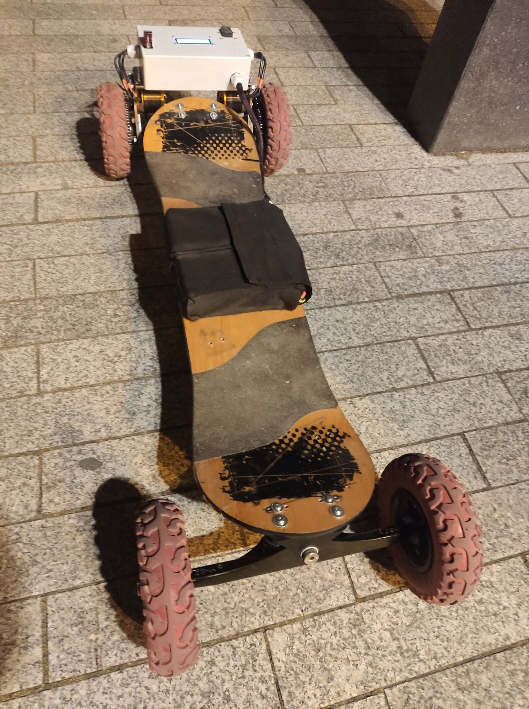
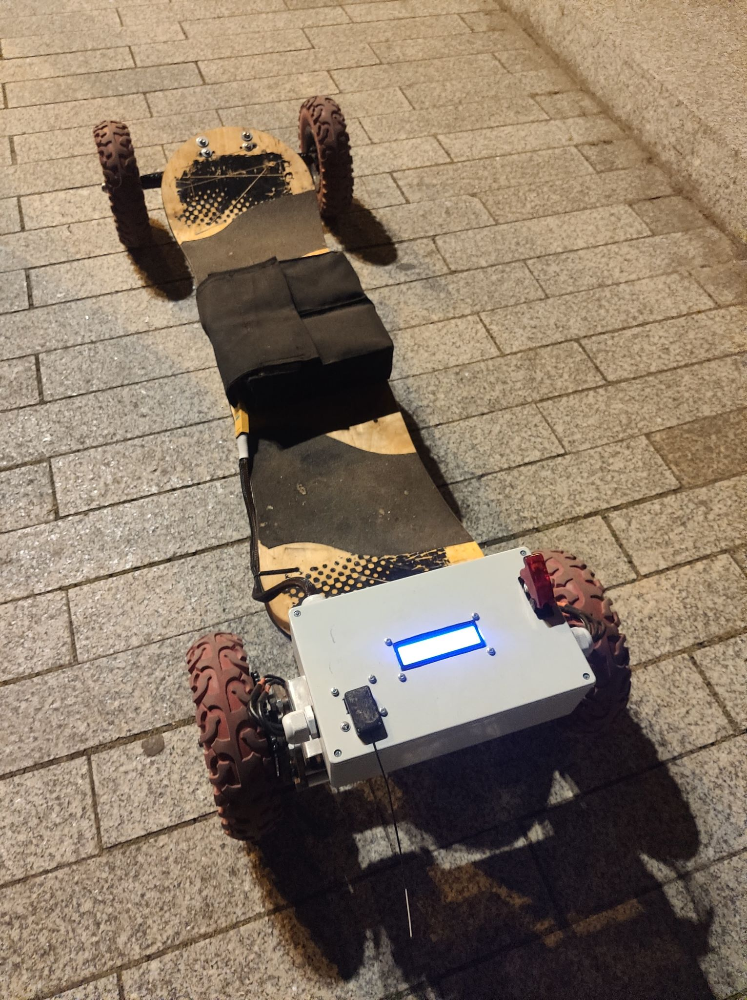
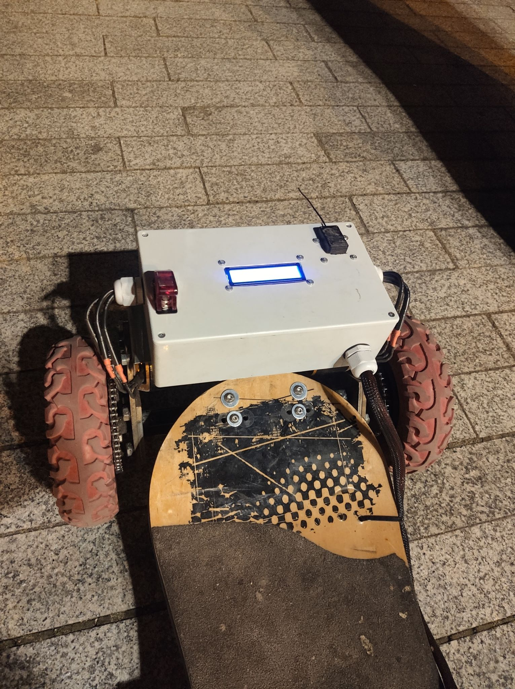

# xD-Board

Too powerful Electric Mountainboard 2x4kW engines with custom made remote controll, based on vadder vesc

# Pins

diagram (link)
micro jst raster 2mm

# Stats

Motor Gear 11
Wheel Gear 50
wheel diameter 200x50mm

battery
8s
10c
16000mh
maxA 160A
maxV 33.6
minV 27.2
avgV 29.6

# FOC Detection

Success!

VESC ID : 24
Motor current : 62.62 A
Motor R : 15.30 mΩ
Motor L : 8.30 µH
Motor Flux Linkage : 4.10 mWb
Temp Comp : False
Sensors : Sensorless
